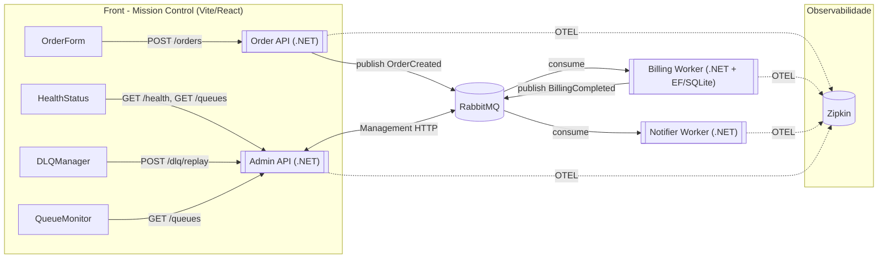

# Mission-Control

Plataforma de **integração com microsserviços** .NET 8 que demonstra:
- **Mensageria** com RabbitMQ + MassTransit
- **Idempotência** no consumidor de billing (SQLite/EF Core)
- **Observabilidade** com OpenTelemetry + Zipkin
- **Admin API** para listar filas e **reprocessar DLQ**
- **Dashboard React** para operar (criar pedidos, monitorar filas e reprocessar DLQ) + experiência do usuário mais fluida


https://github.com/user-attachments/assets/3a3cd84f-b4eb-4803-97ce-4177268a2228


## 🔭 Arquitetura (alto nível)



## 🧰 Tech Stack 🧰

- **.NET 8** (Minimal APIs & Worker Service), **MassTransit**, **RabbitMQ**
- **EF Core + SQLite** (idempotência por `OrderId`)
- **OpenTelemetry** → **Zipkin**
- **Vite + React + TS + Tailwind** (dashboard)
- **Docker Compose** (RabbitMQ + Zipkin)

## 🗂️ Estrutura (resumo) 🗂️

```
Mission-Control/
  docker-compose.yml
  src/
    OrderApi/
    BillingWorker/
      Data/BillingDbContext.cs      # tabela ProcessedOrders (idempotência)
    NotifierWorker/
    AdminApi/                       # /health, /queues, /dlq/replay
    Shared.Contracts/               # eventos: OrderCreated, BillingCompleted
  front/                            # Vite/React dashboard
```

## ✅ Pré-requisitos ✅

- **.NET 8 SDK**
- **Node 18+** e **npm**
- **Docker Desktop** em execução

## 🚀 Subir infraestrutura 🚀

```powershell
cd C:\...\Mission-Control
docker compose up -d
# RabbitMQ UI: http://localhost:15672  (guest/guest)
# Zipkin UI:   http://localhost:9411
```

## 🔓 CORS nas APIs 🔓

Em **OrderApi/Program.cs** e **AdminApi/Program.cs** (após `CreateBuilder`):

```csharp
builder.Services.AddCors(opt =>
{
    opt.AddPolicy("dev", p => p
        .WithOrigins("http://localhost:5173")
        .AllowAnyHeader()
        .AllowAnyMethod());
});
```

Antes de mapear rotas:
```csharp
app.UseCors("dev");
```

> Workers não precisam de CORS.

## ▶️ Executar serviços (.NET) — 4 terminais ▶️

> Ajuste o caminho base se necessário. Rode cada bloco em um **PowerShell** separado.

**(A) Order API – porta 5000**
```powershell
cd C:\...\Mission-Control
$env:ASPNETCORE_URLS="http://localhost:5000"
$env:ZIPKIN_ENDPOINT="http://localhost:9411/api/v2/spans"
$env:RABBITMQ__HOST="localhost"
dotnet run --project .\src\OrderApi\OrderApi.csproj
```

**(B) BillingWorker**
```powershell
cd C:\...\Mission-Control
$env:ZIPKIN_ENDPOINT="http://localhost:9411/api/v2/spans"
$env:RABBITMQ__HOST="localhost"
dotnet run --project .\src\BillingWorker\BillingWorker.csproj
```

**(C) NotifierWorker**
```powershell
cd C:\...\Mission-Control
$env:ZIPKIN_ENDPOINT="http://localhost:9411/api/v2/spans"
$env:RABBITMQ__HOST="localhost"
dotnet run --project .\src\NotifierWorker\NotifierWorker.csproj
```

**(D) AdminApi – porta 5080**
```powershell
cd C:\...\Mission-Control
$env:ASPNETCORE_URLS="http://localhost:5080"
$env:ZIPKIN_ENDPOINT="http://localhost:9411/api/v2/spans"
$env:RABBITMQ__HOST="localhost"
$env:RABBITMQ__USERNAME="guest"
$env:RABBITMQ__PASSWORD="guest"
$env:RABBITMQ__MGMTURI="http://localhost:15672"
dotnet run --project .\src\AdminApi\AdminApi.csproj
```

## 🖥️ Front (dashboard) 🖥️

```powershell
cd C:\...\Mission-Control\front
npm install
npm run dev
# http://localhost:5173
```
No painel **Configurações**:
- **Order API URL:** `http://localhost:5000`
- **Admin API URL:** `http://localhost:5080`

## 🧪 Testes 🧪

### 1) Fluxo (publish → consume → publish → consume)
1. No front, **Criar Novo Pedido** (ex.: amount `123.45`).
2. `OrderApi` publica **OrderCreated** → `BillingWorker` consome, registra em `ProcessedOrders` e publica **BillingCompleted** → `NotifierWorker` consome e loga.
3. Em `http://localhost:9411`, veja o trace (`order-api` → `billing-worker` → `notifier-worker`).

### 2) Idempotência (reenvio do mesmo `OrderId`)
Envie duas vezes o **mesmo** `orderId`:
```powershell
Invoke-RestMethod -Method POST -Uri http://localhost:5000/orders `
  -Body (@{ orderId="A-1001"; customerId="CUST-001"; amount=123.45 } | ConvertTo-Json) `
  -ContentType "application/json"

Invoke-RestMethod -Method POST -Uri http://localhost:5000/orders `
  -Body (@{ orderId="A-1001"; customerId="CUST-001"; amount=123.45 } | ConvertTo-Json) `
  -ContentType "application/json"
```
O `BillingWorker` deve logar **“Skipping duplicate OrderId=A-1001”**. A segunda mensagem **não** replica efeitos.

### 3) DLQ + Replay (simulação de falha)
**No `BillingWorker`** (em `cfg.ReceiveEndpoint`), habilite retry:
```csharp
e.UseMessageRetry(r => r.Interval(3, TimeSpan.FromSeconds(5)));
```
**No `OrderCreatedConsumer.Consume`**, simule falha quando `amount == 13.37`:
```csharp
if (msg.Amount == 13.37m)
    throw new InvalidOperationException("Simulated billing failure for test");
```
Reinicie o worker e crie pedido com `amount=13.37`.  
A mensagem cai em **`billing-ordercreated_error`** (DLQ).

Depois, **remova** a falha e reinicie o worker. No front → **DLQ Manager**:
- Queue: `billing-ordercreated_error`
- Count: `10`
- Clique **Reenviar** → mensagem será reprocessada com sucesso.

## 🔌 Endpoints úteis

- **OrderApi**
  - `GET /` → `{ "status": "ok" }`
  - `POST /orders`
    ```json
    { "orderId": "opcional", "customerId": "opcional", "amount": 99.99 }
    ```

- **AdminApi**
  - `GET /health` → status da AdminApi
  - `GET /queues` → filas (via RabbitMQ Management API)
  - `POST /dlq/replay?queue=<fila_error>&count=10` → **reprocessa DLQ**

## 🌱 Variáveis de ambiente (resumo) 🌱

| Serviço        | Variáveis                                                                                           |
|----------------|------------------------------------------------------------------------------------------------------|
| OrderApi       | `ASPNETCORE_URLS`, `ZIPKIN_ENDPOINT`, `RABBITMQ__HOST`, (`RABBITMQ__USERNAME`/`RABBITMQ__PASSWORD`) |
| BillingWorker  | `ZIPKIN_ENDPOINT`, `RABBITMQ__HOST`, (`RABBITMQ__USERNAME`/`RABBITMQ__PASSWORD`)                    |
| NotifierWorker | `ZIPKIN_ENDPOINT`, `RABBITMQ__HOST`, (`RABBITMQ__USERNAME`/`RABBITMQ__PASSWORD`)                    |
| AdminApi       | `ASPNETCORE_URLS`, `ZIPKIN_ENDPOINT`, `RABBITMQ__HOST`, `RABBITMQ__USERNAME`, `RABBITMQ__PASSWORD`, `RABBITMQ__MGMTURI` |

## 🧯 Troubleshooting 🧯

- **`npm i` ENOENT** → rode dentro de `front\` (onde existe `package.json`).
- **CORS bloqueando fetch** → confirme `app.UseCors("dev")` nas APIs e origem `http://localhost:5173`.
- **RabbitMQ indisponível** → `docker compose up -d` e aguarde uns 15s.
- **/queues 401** na AdminApi → confira `RABBITMQ__USERNAME/PASSWORD` (guest/guest).
- **Zipkin vazio** → confira `ZIPKIN_ENDPOINT` em **todas** as apps.
- **Portas ocupadas** → altere `ASPNETCORE_URLS` ou encerre processos que usam 5000/5080.

## 🛣️ Roadmap 🛣️

- **Azure Service Bus** como transporte alternativo (MassTransit).
- **Cosmos DB** para idempotência/auditoria.
- **Key Vault** + **Managed Identity** para segredos/acessos.
- **API Gateway** (Sensedia/APIM): versionamento, throttling, auth, observabilidade centralizada.
- **Pipelines** (Azure DevOps/GitHub Actions): build → testes → imagens Docker → deploy.
